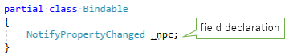
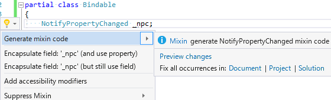
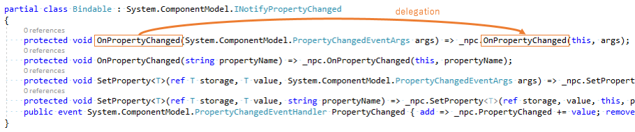

# MixinGenerator

- analyzer & code fix: [MixinGenerator](https://www.nuget.org/packages/MixinGenerator/)
- common mixins: [MixinGenerator.Mixins](https://www.nuget.org/packages/MixinGenerator.Mixins/)

## How to use

1. Composition

2. Quick Action (C# Analyzer & Code Fix))

3. Delegation (Generated Source Code)

